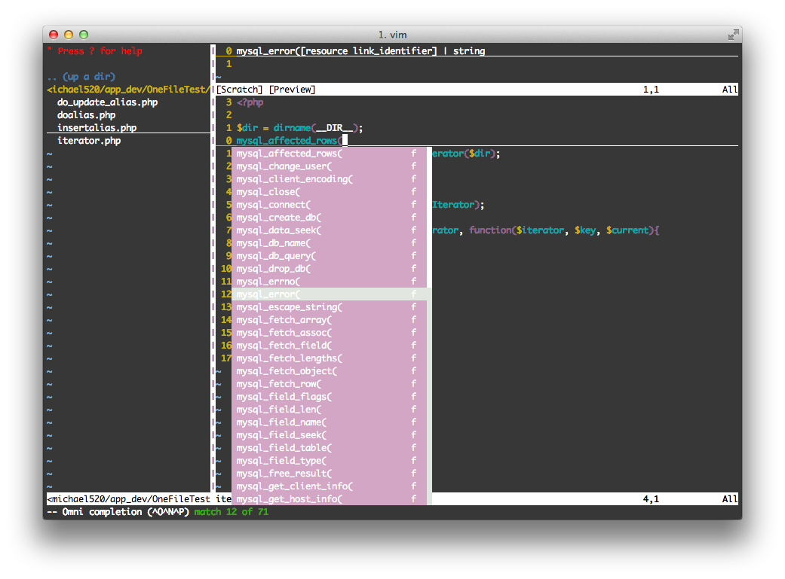

Note My VIM Settings
---------------
My .vimrc setting that wish looks like .


Using plugins

  - NERDTree <https://github.com/scrooloose/nerdtree>
       
    need from 
    - pathogen.vim <https://github.com/tpope/vim-pathogen>
    - sensible.vim <https://github.com/tpope/vim-sensible>

  - phpcomplete
    This is installed for VIM 7.0 upper.
    
    enable the feature in .vimrc
    ```sh
    filetype plugin on                                             
    autocmd FileType php set omnifunc=phpcomplete#CompletePHP
    ```

    Then use Ctrl+x and Ctrl+o to to display omnicompletion menu and Ctrl+n, Ctrl+p to select that you want .



  - snipMate <http://www.vim.org/scripts/script.php?script_id=2540>
    
    use key
    - input 'for' than Tab
    - input 'foreach' than Tab
    - input 'class' than Tab
    - input 'fun' than Tab

  - zencodeing <http://www.vim.org/scripts/script.php?script_id=2981>

    example
    - input 'html:5' than Ctrl + y and Comma
    - input 'div#foo$*2>div.bar' then Ctrl + y and Comma
    - other magic see <http://docs.emmet.io/cheat-sheet/>

Remember rename the "dot_vimrc" to ".vimrc" and put in the your home dir . 
