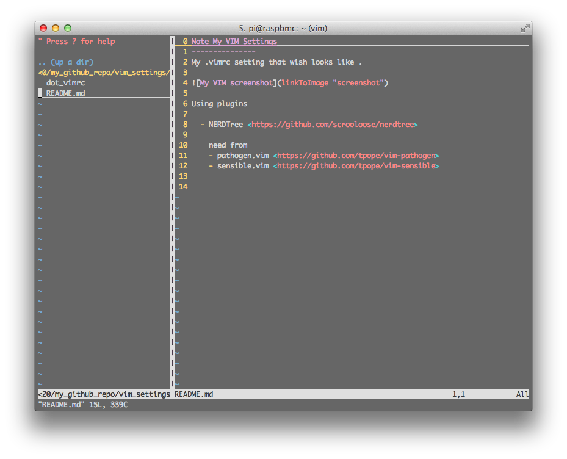

Note My VIM Settings
---------------
My .vimrc setting that wish looks like .

Using plugins

  - NERDTree <https://github.com/scrooloose/nerdtree>
       
    need from 
    - pathogen.vim <https://github.com/tpope/vim-pathogen>
    - sensible.vim <https://github.com/tpope/vim-sensible>

